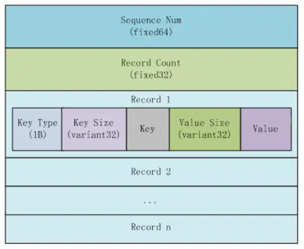

## 写入流程
  - 1. 将N条更新记录封装到一个WriteBatch中
  - 2. 将WriteBatch Encoding后写入日志
  - 3. 将WriteBatch中的记录写入memtable

- Write Batch   
  - 固定头部格式：  
    > 固定头部共12字节，其中前8字节为WriteBatch的序列号（也就是每个操作对应的全局序列号），对应rep_[0]到rep_[7]，每次处理Batch中的记录时才会更新，后四字节为当前Batch中的记录数，对应rep_[8]到rep_[11]；  
  - 后面的记录结构为：
    - 插入数据：type（kTypeValue、kTypeDeletion），Key_size，Key，Value_size，Value
    - 删除数据：type（kTypeValue、kTypeDeletion），Key_size，Key

- Write Group
  > 每个写线程都会生成一个WriteThread::Write，将待写的数据加入write链表中，交由Leader线程执行后续的写入处理。
  - leader线程构造一个WriteGroup对象
  - 检查是否可以并发写入memtable，条件有：
    - 1. memtable本身支持；
    - 2. 有设置allow_concurrent_memtable_write
    - 3. 不含merge操作 
   - 写WAL文件：将WriteGroup中的记录fsync到WAL文件中
   - 如果不支持并发写memtable，leader串行将WriteGroup的所有数据串行地写到memtable；否则，leader线程将通知所有的follower线程并发写memtable
  - 待所有的线程写入memtable完成后，如果writer链表上有新的待提交的事务，将它设置成leader,组织下一次WriteGroup；退出本次WriteGroup

## 读取流程
