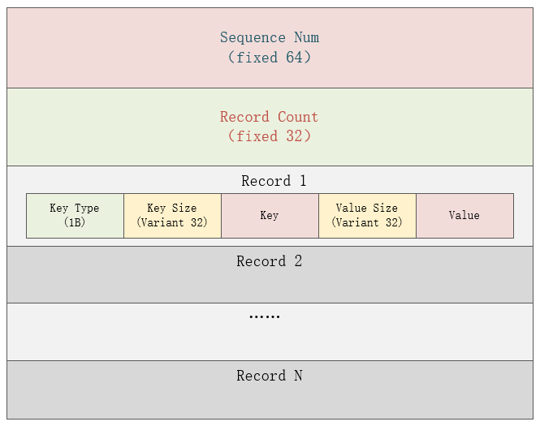

## 写入流程
  

- Write Batch   
  - 固定头部格式：  
    - 固定头部共12字节，其中前8字节为WriteBatch的序列号（也就是每个操作对应的全局序列号），对应rep_[0]到rep_[7]，每次处理Batch中的记录时才会更新，后四字节为当前Batch中的记录数，对应rep_[8]到rep_[11]；  
  - 后面的记录结构为：
    - 插入数据：type（kTypeValue、kTypeDeletion），Key_size，Key，Value_size，Value
    - 删除数据：type（kTypeValue、kTypeDeletion），Key_size，Key

## 读取流程

