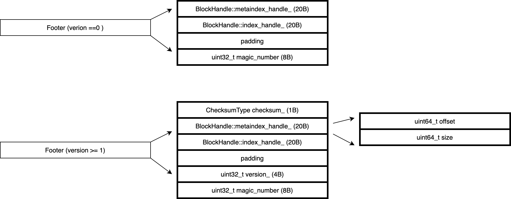

## [BlockBasedSST](https://github.com/facebook/rocksdb/wiki/Rocksdb-BlockBasedTable-Format)
  ```
  <beginning_of_file>
    [data block 1]
    [data block 2]
    ...
    [data block N]
    [meta block 1: filter block]                  (see section: "filter" Meta Block)
    [meta block 2: index block]                   (实际上是放在footer中!)
    [meta block 3: compression dictionary block]  (see section: "compression dictionary" Meta Block)
    [meta block 4: range deletion block]          (see section: "range deletion" Meta Block)
    [meta block 5: stats block]                   (see section: "properties" Meta Block)
  
    [meta block K: future extended block]  (we may add more meta blocks in the future)
    [metaindex block]
    [Footer]                               (fixed size; starts at file_size - sizeof(Footer))
  <end_of_file>
  ```
[备注：Leveldb SST格式](https://github.com/google/leveldb/blob/main/doc/table_format.md)

#### 组成
- Data Block Format
  - entry: | sharedKeyLen | unsharedKeyLen | valLen | unsharedKey | value |
  - restart_point: 前缀压缩的重启点
  - restart_count: restart_point的数量
  ```
  <beginning_of_datablock>
    [entry 1]
    [entry 2]
    ...
    [entry N]
    [restart_point 1]
    [restart_point 2]
    ...
    [restart_point M]
    [restart_count]
  <end_of_datablock>
  ```

- Index Block Format
  - IndexBlock用于快速查找目标key的范围。每个SST拥有一个index block，每个data block对应着一个entry，这个entry的key >=对应的data block的last_key，并且小于下一个block的first_key，这个entry的value是DataBlockHandle。
  ```
  <beginning_of_indexblock>
    [data_block_handle 1]
    [data_block_handle 2]
    ...
    [data_block_handle N]
  <end_of_indexblock>
  ```
- Filter Block Format
  - filter_entry：记录真实filter的bitmap信息
  - filter_entry_offset：每个filter_entry的offset
  - filter_entry_offset_array_offset：第1个filter_entry_offset的offset
  ```
  <beginning_of_filterblock>
    [filter_entry 1]
    [filter_entry 2]
    ...
    [filter_entry N]
    [filter_entry_offset 1]
    [filter_entry_offset 2]
    ...
    [filter_entry_offset N]
    [filter_entry_offset_array_offset]
    [base]
  <end_of_filterblock>
  ```
- MetaIndex Block Format
  - MetaIndex Block按KV存储(key为某block的名字，value为某block的handle)，用于读取SST时快速定位其它block。
  ```
  <beginning_of_file>
    [key + filter block handle]
    [key + index block handle]
    [key + compression dictionary block handle]
    [key + range deletion block handle]
    [key + stats block handle]
    <end_of_file>
  ```

- Footer Format
    
  ```
  <beginning_of_footer>
    [checksum (seq + type)]     // 1B
    [metaindex_handle]          // < 20B
    [index_handle]              // < 20B
    [padding]                   // metaindex_handle和index_handle共占用40B，不足补0
    [footer version]            // 4B
    [table_magic_number]        // 8B
  <end_of_footer>
  ```
  - Footer由53字节构成
  - BlockHandle： | offset | size |

#### SST Table Build 核心代码
- Build
  ```
  Status BuildTable( const std::string& dbname, VersionSet* versions, ...) {
    iter->SeekToFirst();
    if (iter->Valid() || !range_del_agg->IsEmpty()) {
      TableBuilder* builder;
      {
        IOStatus io_s = NewWritableFile(fs, fname, &file, file_options);
        builder = NewTableBuilder(tboptions, file_writer.get());
      }
      CompactionIterator c_iter(
              iter, tboptions.internal_comparator.user_comparator(), &merge,...);
      c_iter.SeekToFirst();
      for (; c_iter.Valid(); c_iter.Next()) {
        // 在data_block中add一个kv，在Add中若发现已经满一个block就会将block_handle记录到index_block
        builder->Add(key, value);
      }
      // 其它非data_block刷盘
      s = builder->Finish();
      EventHelpers::LogAndNotifyTableFileCreationFinished(...);
    }
  }
  ```
- Finish
  ```
    Status BlockBasedTableBuilder::Finish() {
      r->index_builder->AddIndexEntry(
          &r->last_key, nullptr /* no next data block */, r->pending_handle);
      BlockHandle metaindex_block_handle, index_block_handle;
      MetaIndexBuilder meta_index_builder;
      WriteFilterBlock(&meta_index_builder);
      WriteIndexBlock(&meta_index_builder, &index_block_handle);
      WriteCompressionDictBlock(&meta_index_builder);
      WriteRangeDelBlock(&meta_index_builder);
      WritePropertiesBlock(&meta_index_builder);
      if (ok()) {
        // flush the meta index block
        WriteRawBlock(meta_index_builder.Finish(), kNoCompression,
            &metaindex_block_handle, BlockType::kMetaIndex);
      }
      if (ok()) {
        WriteFooter(metaindex_block_handle, index_block_handle);
      }
    }
  ```
- WriteFooter
  ```
    // Write meta blocks, metaindex block and footer in the following order.
    //    1. [meta block: filter]
    //    2. [meta block: index]
    //    3. [meta block: compression dictionary]
    //    4. [meta block: range deletion tombstone]
    //    5. [meta block: properties]
    //    6. [metaindex block]
    //    7. Footer
    BlockHandle metaindex_block_handle, index_block_handle;
    MetaIndexBuilder meta_index_builder;
    WriteFilterBlock(&meta_index_builder);
    WriteIndexBlock(&meta_index_builder, &index_block_handle);
    WriteCompressionDictBlock(&meta_index_builder);
    WriteRangeDelBlock(&meta_index_builder);
    WritePropertiesBlock(&meta_index_builder);
  
    if (ok()) {
      // flush the meta index block
      WriteRawBlock(meta_index_builder.Finish(), kNoCompression,
        &metaindex_block_handle, BlockType::kMetaIndex);
    }
    if (ok()) {
      WriteFooter(metaindex_block_handle, index_block_handle);
    }
  ```
