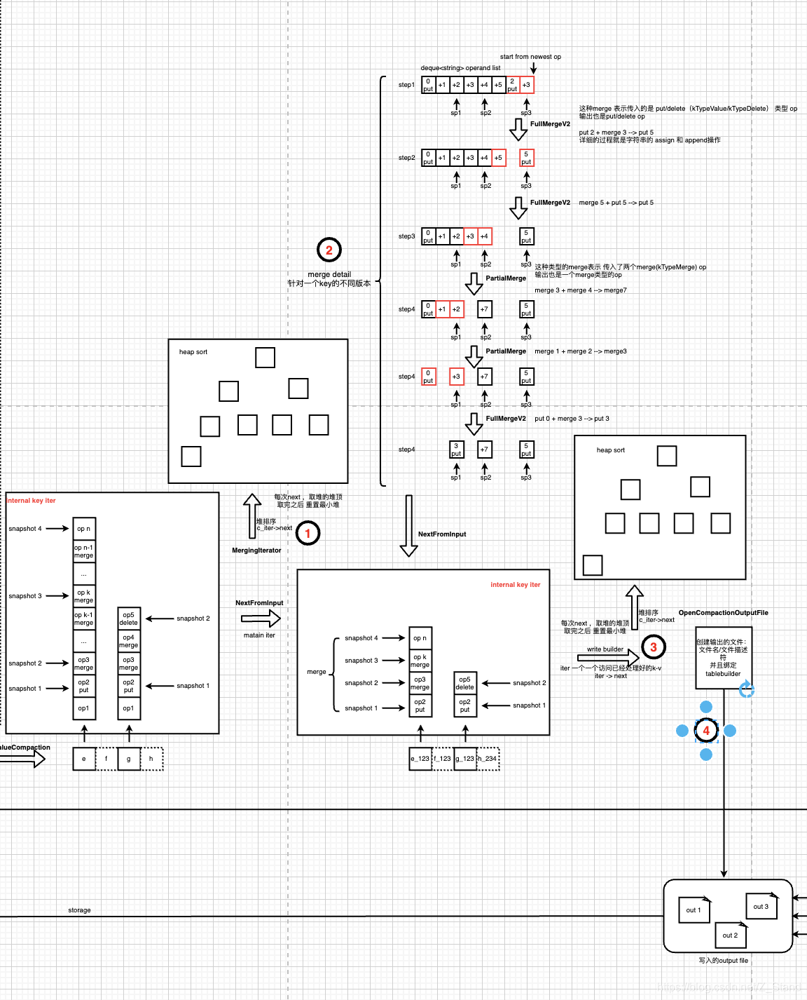
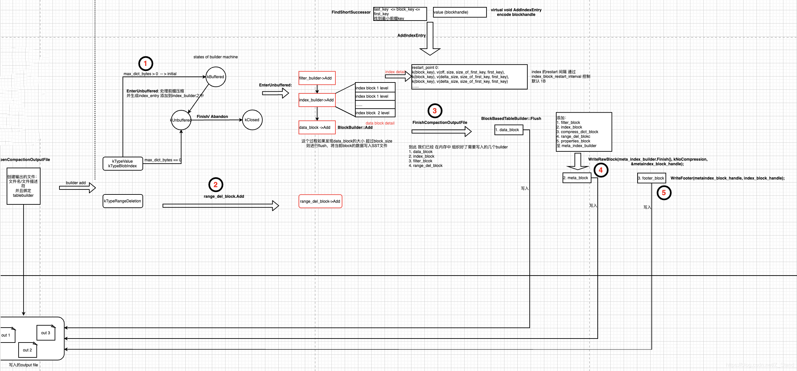

#### Compaction
rocksdb的compaction是通过后台线程执行BGWorkCompaction来进行Compaction的调度

#### Compaction的触发
- 手动触发，执行CompactFiles调用
- 自动检测，执行MaybeScheduleFlushOrCompaction
  - 在切换WAL(SwitchWAL)时
  - write_buffer(memtable)满时

#### Compaction整体流程
- Prepare key: 从SST文件中读取需要参与Compaciton的K-V数据  
  
  - 根据每一层的score来取出参与compaction层
  - 利用clean cut算法从层中取出参与compaction的文件
  - 将文件中的key-value边界取出，并做一个边界排序，确认最终的key的边界范围
  - 依据边界范围，按照subcompaction limit 拆分成多个subcompaction ， 创建对应的sub处理的线程执行任务
- Process key: K-V数据的合并、排序，处理不同的key type的操作
  
  - 将当前subcompaction的K-V数据取出，维护一个InternalIterator迭代器来进行访问（此时会构造一个堆排序的存储结构，来通过迭代器访问堆顶元素）
    - 1. 针对Level-0，为其中的每一个SST文件构建一个table_cache迭代器
    - 2. 针对其它非Level-0的层，每一层直接创建一个级联的迭代器
    - 3. 将所有迭代器添加到一个迭代器数组之中，通过 NewMergingIterator 将迭代器数组维护成一个底层的排序堆结构，以此来实现所有key-value的排序
  - 合并的过程主要是取到当前internal key的最新的snapshot对应的操作（主要针对put/delete，保留range_deletion）
  - 将合并好的数据返回，交给迭代器一个一个 进行访问，并进行后续的write操作（每访问一个，pop堆顶，并重建堆，再取堆顶元素）
  - 创建输出的文件，并绑定builder 和 writer，方便后续的数据写入

- Write key: 将K-V数据写入对应的Block中  
  函数入口：`ProcessKeyValueCompaction`
  
  - 确认key 的valueType类型，如果是data_block或者index_block类型，则放入builder状态机中；优先创建filter_buiilder和index_builder，index builer创建成 分层格式(两层index leve, 第一层多个restart点，用来索引具体的datablock；第二层索引第一层的index block)，方便加载到内存进行二分查找，节约内存消耗，加速查找；其次再写data_block_builder
  - 如果key的 valueType类型是 range_deletion，则加入到range_delete_block_builder之中
  - 先将data_block builder 利用绑定的输出的文件的writer写入底层文件
  - 将filter_block / index_builder / compress_builder/range_del_builder/properties_builder 按照对应的格式加入到 meta_data_builder之中，利用绑定ouput 文件的 writer写入底层存储
  - 利用meta_data_handle 和 index_handle 封装footer,写入底层存储
