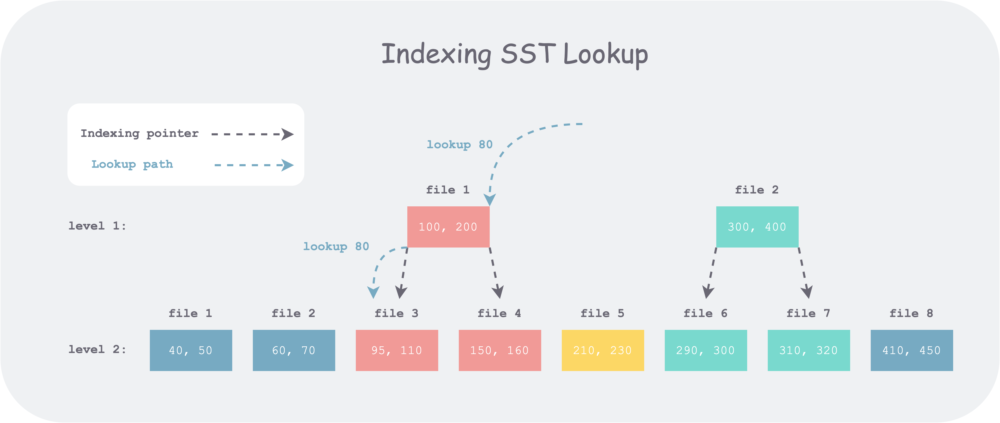

Index 可以理解为索引，通俗的说其实是从大范围到小范围的定位和查找，在Rocksdb中，从Memtable到SST、Block都存在着索引，甚至是大事务中的WriteBathWithIndex也存在着Index技术。如下，我们逐步展开来讨论索引技术。
## Index Filter
- Level-0中的SST范围重叠，需要逐个去访问；
- Level-1及以下，同一层的SST不重叠且有序，可以使用二分查找技术而非线性查找；但是当SST数量较多时，二分查找效率较低，观察到对于Version来说，SST的顺序不变，可以将上层的SST构筑对应重叠范围的下层SST区间，这样可以加速查找.  

