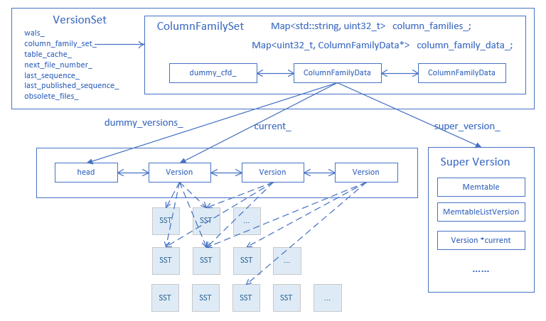

> Rocksdb使用MVCC机制来提供事务的可见性；相关的概念主要有3个：Version、VersionEdit、VersionSet。
#### MANIFEST
- MANIFEST保存着每次的版本修改记录VersionEdit，而VersionEdit的操作对象则是Version。
- 当Manifest log超过一定尺寸的时候会切换到下一个文件，同时写入一个全量的Version。
#### VersionSet

