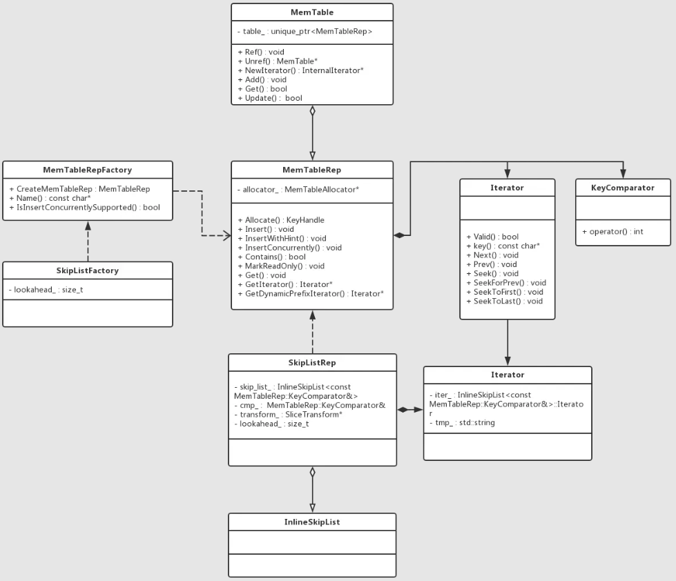

## Memtable
在RocksDB中，WAL的写入是单线程顺序写入的，而MemTable则是可以并发多线程写入的。

## 选型
- SkipList
默认，支持并发插入，范围查找性能好
- HashSkipList
不支持并发插入，点查性能好，范围查找性能差，耗内存
- HashLinkList
不支持并发插入，点查性能好，范围查找性能差，耗内存
- Vector
顺序读写性能好，随机写性能差

## 实现
Memtable 中维护了两个sub-table，其中范围删除插入 range_del_table_，其余的操作写入 table_。


#### Memtable 定义的Put步骤如下：
 - 将key、value、seq合成特定格式的entry: > | internal_key_size: 包括 key + type的长度 | key | seqid + type | value size | value |
 - 根据不同的条件调用 table->InsertXXX() 插入
   - 并发插入: InsertConcurrently()
   - 非并发插入
     - 提取前缀插入：InsertWithHint()
     - 普通插入：Insert()
```
bool MemTable::Add(SequenceNumber s, ValueType type,
        const Slice& key, /* user key */
        const Slice& value, bool allow_concurrent,
        MemTablePostProcessInfo* post_process_info) {
    // 一条key-value Entry的数据格式
    //  key_size     : varint32 of internal_key.size()
    //  key bytes    : char[internal_key.size()]
    //  value_size   : varint32 of value.size()
    //  value bytes  : char[value.size()]
    uint32_t key_size = static_cast<uint32_t>(key.size());
    uint32_t val_size = static_cast<uint32_t>(value.size());
    uint32_t internal_key_size = key_size + 8;
    const uint32_t encoded_len = VarintLength(internal_key_size) +
        internal_key_size + VarintLength(val_size) +
        val_size;
    char* buf = nullptr;
    // 通过判断key-value的类型来选择memtable, 范围删除的kv插入range_del_table_
    std::unique_ptr<MemTableRep>& table =
        type == kTypeRangeDeletion ? range_del_table_ : table_;
    KeyHandle handle = table->Allocate(encoded_len, &buf);
    //...
    // 是否允许并发插入
    if (!allow_concurrent) {
        // 是否制定了函数提取key的前缀
        if (insert_with_hint_prefix_extractor_ != nullptr &&
                insert_with_hint_prefix_extractor_->InDomain(key_slice)) {
            // ...
            bool res = table->InsertWithHint(handle, &insert_hints_[prefix]);
        } else {
            // 插入key-value pair
            bool res = table->Insert(handle);
            if (UNLIKELY(!res)) {
                return res;
            }
        }
    } else {
        // 插入key-value pair
        bool res = table->InsertConcurrently(handle);
        if (UNLIKELY(!res)) {
            return res;
        }
    }
    return true;
}
```
#### Memtable 定义的Get步骤如下：

#### Fluash
- Memtable 数量到达上限
- 所占内存过多
- WALlog达到阈值
