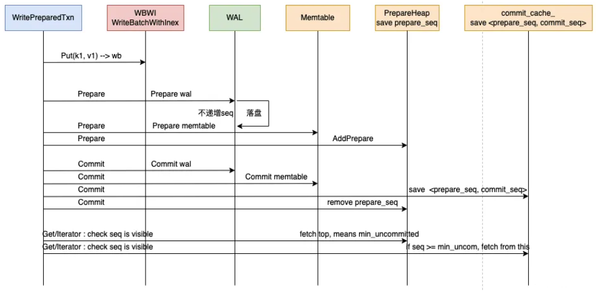

## 事务ACID特性
各个事务内部维护一个WriteBatch(内存对象)，本事务Commit之前优先读该WriteBatch(同一事务内写操作可见)，写操作直接写入本事务WriteBatch，提交依次写入WAL和MemTable，依赖WriteBatch的原子性和隔离性实现了ACID。
- 原子性（A）：事务内一次执行过程所包含各项操作，全部成功或全部失败；依赖WriteBatch实现；
- 一致性（C）：事务执行不破坏数据完整性，从一个一致性状态到另一个一致性状态；依赖WAL和WriteBatch实现；
- 隔离性（I）：并发事务相互隔离，事务之间不相互干扰；依赖并发控制、MVVC实现；
- 持久性（D）：事务提交后对于记录更改操作永久保存；依赖SST持久化文件、WAL实现；

## 使用RocksDB Transaction
```
// 基本配置,事务相关操作需要TransactionDB句柄
Options options;
options.create_if_missing = true;
TransactionDBOptions txn_db_options;
TransactionOptions txn_opts;
TransactionDB* txn_db;

// 用支持事务的方式opendb
TransactionDB::Open(options, txn_db_options, kDBPath, &txn_db);

// 创建一个事务上下文, 类似MySQL的start transaction
Transaction* txn = txn_db->BeginTransaction(txn_opts);

// 直接写入新数据
txn->Put("abc", "123");

// ForUpdate写，类似MySQL的select ... for update
s = txn->GetForUpdate(read_options, "abc", &value); 

// 结束事务：提交(或回滚)
txn->Commit();      
//txn->Rollback();
```
## 两阶段提交
RocksDB只在PessimisticTransaction支持了2PC，在写记录和Commit之间增加一个Prepare操作； 根据提交策略有以下三种：
#### WriteCommitted(默认)：Commit步骤提交Memtable;
- 流程：
  - 1. 创建 WRITE_COMMITED 事务
  - 2. SetName 注册到 DB级别的全局事务管理map中，将唯一标识当前2pc的事务名和事务对象标识起来
  - 3. Put 更新数据到事务对象中，因为是悲观事务，所以会在加锁的时候做冲突检测以及死锁检测
  - 4. Prepare 增加 begin/end prepare标识到writebatch中，并只写WAL，但是不递增全局seq
  - 5. Commit，增加commit 标识到 writebatch并写WAL, 将writebatch写入memtable
- 问题：
  - 1. 更新数据都会被暂存到 WBWI 的内存中，假如有大量的长事务，内存会有非常大的压力
  - 2. Commit阶段 memtable的写压力会非常大，甚至会导致write stall
#### WritePrepared：Prepared步骤写入Memtable;
流程：  
  
- 可见性判断(拿snapshot的seq和key的seq来比较)：
  - key_seq == 0, 可见; Compaction 会把对所有snapshot可见的key的seq设置为0 （bottom-level）
  - key_seq > snapshot_seq , 不可见; 说明snapshot后才写入
  - key_seq < min_uncommitted_seq，可见; 说明已经提交
  - min_uncommitted_seq <= key_seq < snapshot_seq，需要判断:
    - 拿 key_seq 在 commit_cache_ 中能匹配上对应的record，可见；说明当前 key_seq 是两阶段中已经 committed的
    - 匹配不上说明不可见
- rollback:
rollback 阶段会构造一个 包含当前事务所有key的rollback_batch，设置其中每个key的seq为 kMaxSequenceNumber，走写入逻辑（这样对所有snapshot都不可见，compaction时会清理 seq为 kMaxSequenceNumber 的key ）; 实际走写memtable的时候会做优化: 
    - 如果key还在memtable中存在，则直接修改；
    - 如果不存在则会写入delete key;

#### WriteUnprepared：写操作（Put、Delete等）写入Memtable;

## 事务隔离级别
RocksDB基于MVCC机制提供了 Read Commited 和 Repeatable Read 两种隔离级别。
#### Repeatable Read
```
TransactionOptions txn_opts;
ReadOptions rops;

Transaction* txn = txn_db->BeginTransaction(WriteOptions(), txn_opts);
assert(txn != nullptr);
PrintStatus("txn->put", txn->Put("key1", "value2"));
PrintStatus("txn->Commit", txn->Commit());

// 开启设置snapshot，标识后续该事务 对所有自己更新的key都是独占的
txn_opts.set_snapshot = true;
txn = txn_db->BeginTransaction(WriteOptions(), txn_opts);
assert(txn != nullptr);

// 在其他事务更新之前设置一个snapshot, 隔离级别Repeatable-Read
const Snapshot* snapshot = txn->GetSnapshot();
PrintStatus("txn_db->Put", txn_db->Put(WriteOptions(), "key1", "value3"));

// 普通的读，能够读到value3
PrintStatus("txn->Get", txn->Get(rops, "key1", &value));

// snapshot 读，读到的是value2
rops.snapshot = snapshot;
PrintStatus("txn->Get", txn->Get(rops, "key1", &value));
```

## 事务方式
RocksDB实现了乐观事务和悲观事务(默认是悲观事务)，这两者的不同之处在于冲突检测的时机不同：OptimisticTransaction在Commit操作时，通过OptimisticTransactionCallback回调CheckTransactionForConflicts进行冲突检测；PessimisticTransaction（默认事务类型）在Put、Delete等操作记录时，通过TryLock方法针对tracked key加锁，Commit完成时通过UnLock方法解锁。
#### 乐观事务
#### 悲观事务

## 事务实现
#### TransactionDB (Pessimistic)
#### OptimisticTransactionDB
Prepare的时候不使用任何锁，Commit的时候检查是否有修改了正在进行的事务。如果有冲突（或者它无法做决定），提交会返回错误，该事务中的任何key都不会被写入。
